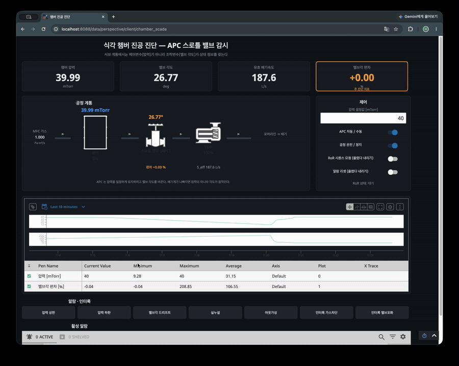
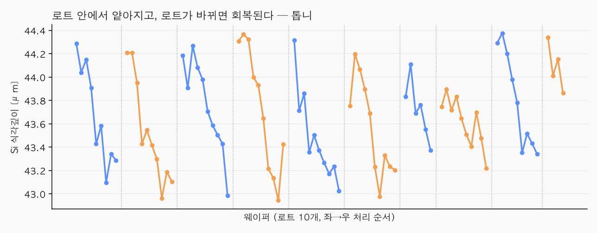
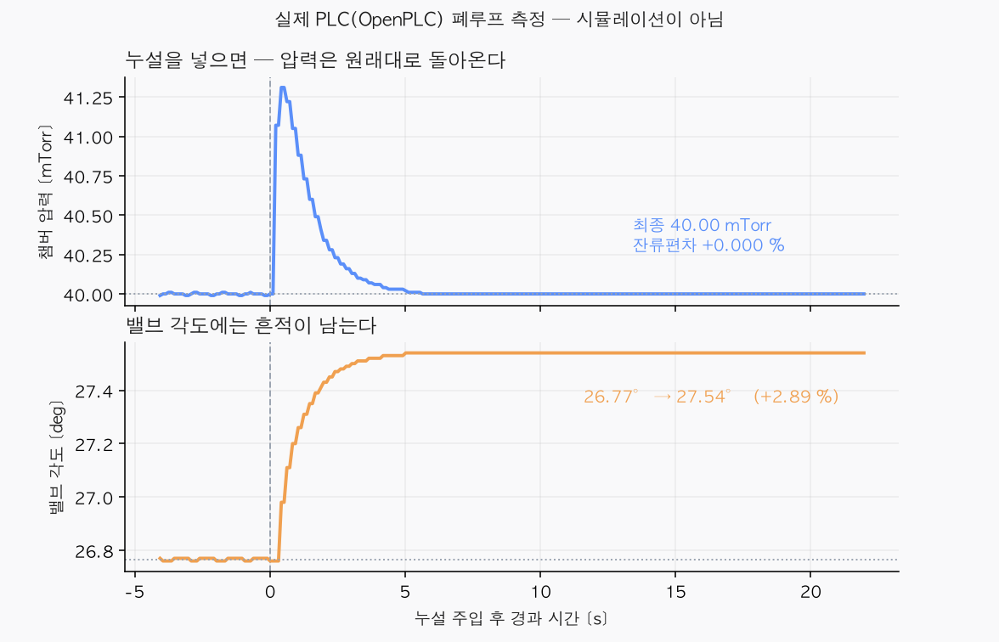
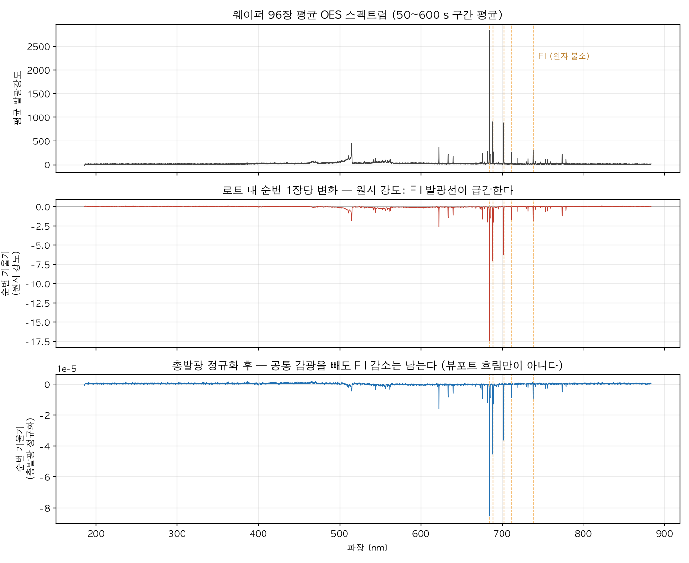

# 식각 챔버 진공 디지털 트윈

### ▶ **[시뮬레이터 열기](https://jiu7021.github.io/etch-chamber-vacuum-twin/)** — 설치 없이 브라우저에서 바로 작동합니다

---

## 요약

반도체 식각 장비는 쓸수록 챔버 안이 오염되어 덜 깎입니다. **언제 청소해야 하는지를 미리 알 수 있을까**가 이 프로젝트의 질문이었습니다.

공개된 실측 데이터(웨이퍼 96장, 2개월)를 분석해 **한 묶음(로트) 안에서 뒤로 갈수록 식각 깊이가 얕아지는 현상**을 확인했습니다. 원인을 찾으려 압력·유량 등 **기록된 31개 계측값을 전부 조사했지만 하나도 설명하지 못했습니다.**

원인은 압력을 일정하게 유지해주는 자동제어 장치였습니다. **제어가 걸린 계통에서는 제어되는 값이 아니라 제어하는 수단에 정보가 남는다** — 이 관점으로 바꿔 **배기 밸브의 각도**를 지목했지만, 그 값은 데이터에 기록돼 있지 않았습니다.

그래서 진공 물리식으로 밸브 각도를 계산해내는 **디지털 트윈**을 만들고, 실제 PLC(OpenPLC)와 SCADA(Ignition)에 연동해 **장비 없이 제어·감시·알람을 시험할 수 있는 시스템**을 구축했습니다. 검증 결과 밸브 각도가 손으로 푼 해석해와 **소수점 셋째 자리까지 일치**했습니다.



*설정값을 40 → 30 mTorr로 바꾸자 밸브가 열리며 압력이 따라 내려가고, 밸브각 편차 알람이 점등됩니다. 실제 PLC가 제어하는 화면입니다.*

---

## 1. 문제 발견 — 로트 안에서 얕아지고, 로트가 바뀌면 회복된다

데이터 개요를 보다가 규칙적인 패턴을 발견했습니다.



한 로트(10장) 안에서 뒤로 갈수록 식각 깊이가 얕아지고, 다음 로트가 시작되면 원래대로 돌아옵니다. **10장 진행에 2.72% 얕아지며**, 우연으로 보기 어려운 수준이었습니다 (p = 8.5e-26).

> 이 데이터는 원래 **세정 횟수의 영향**을 보려고 공개된 것인데, 원 저자들은 *"세정 조건 자체의 영향에 대해서는 뚜렷한 추세를 확립하지 못했다"* 고 적었습니다. 저는 같은 데이터에 **"한 로트 안에서 장수가 쌓이면 어떻게 되는가"** 라는 다른 질문을 던졌습니다.

## 2. 첫 가설 — 오염이 쌓이면 압력이 변할 것이다 → **기각**

챔버에 부산물이 쌓이면 배기가 막혀 압력이 올라갈 것이라 보았습니다. 확인해보니 **압력은 변동계수 0.03%로 사실상 상수**였습니다.

원인은 **APC(자동압력제어)** 였습니다. 압력이 흔들리면 밸브를 움직여 즉시 되돌려 놓기 때문에, 겉으로는 아무 일도 없어 보입니다.

## 3. 두 번째 — 배기 속도를 보자 → **기각**

배기 속도는 `가스량 ÷ 압력`으로 구합니다. 그런데 가스량은 레시피가 정하고 압력은 상수였습니다. **분자도 분모도 안 변하니 그 몫에도 정보가 없었습니다.**

## 4. 세 번째 — 배기구 하류(포어라인)를 보자 → **부분 성공**

포어라인 압력에서는 로트마다 리셋되는 톱니를 찾았습니다. 배기계에 뭔가 쌓였다 없어진다는 것과 부합했지만, **식각 깊이가 얕아지는 것은 설명하지 못했습니다.**

## 5. 전수 조사 — 31개 채널 전부 → **음성**

기록된 모든 계측값을 다중비교 보정과 함께 조사했습니다. **식각 깊이 변화를 설명하는 채널은 하나도 없었습니다.**

## 6. 관점을 뒤집었다 — 조작변수를 보자

여기서 생각을 바꿨습니다.

> **압력이 일정한 것은 정보가 없어서가 아니라, 제어기가 계속 보정하고 있기 때문이다.**

크루즈 컨트롤을 켜고 오르막을 오르면 속도계는 그대로지만 **액셀은 더 밟힙니다.** 속도계만 보면 오르막인지 알 수 없습니다.

| | 평지 | 오르막 |
|---|---|---|
| 속도계 (= 챔버 압력) | 100 km/h | **100 km/h** |
| 액셀 개도 (= 밸브 각도) | 20% | **35%** |

그렇다면 정보는 제어 결과인 압력이 아니라 **제어 수단인 배기 밸브 각도**에 남아 있어야 합니다. 그런데 **이 값은 데이터에 기록돼 있지 않았습니다.**

## 7. 디지털 트윈 — 기록되지 않은 값을 물리식으로 복원

진공 배기 방정식으로 챔버를 재현하고, 압력과 가스량으로부터 밸브 각도를 역산하는 시뮬레이터를 만들었습니다.

실측 압력 재현 오차가 **고정 배기속도 모델 34.8% → APC 모델 8.2%** 로 줄었고, 96장 전부에서 APC 모델이 우세했습니다. 즉 **실제 장비에 APC가 걸려 있다는 것이 데이터로 확인**되었습니다.

## 8. 실제 PLC에 올려 검증

시뮬레이터 안에서만 맞는 것은 자기 채점입니다. 그래서 **제어 로직을 IEC 61131-3 구조화 텍스트(ST)로 다시 작성해 실제 PLC 런타임에 올리고**, 물리 모델과는 완전히 분리된 별도 프로세스로 통신(Modbus TCP)만으로 연결했습니다.



누설을 주입하자 —

| | 결과 |
|---|---|
| 압력 | 40.00 mTorr로 **완전 복귀** (잔류편차 0.000%) |
| **밸브 각도** | 26.77° → **27.54°로 이동한 채 남음** (+2.89%) |
| 손으로 푼 해석해 | **27.5411°** — 실측과 오차 **0.00%** |
| 정정 시간 | 4.07초 (사전 예측 4.1초) |

**압력만 보면 아무 일도 없었습니다. 고장은 밸브 각도에만 남았습니다.**

## 9. SCADA 연동 — 감시하고 조작하는 화면

현장에서 쓰는 형태로 만들기 위해 3계층 구조를 구성했습니다.


압력 트렌드가 아니라 **밸브각 편차**를 주 지표로 두었습니다. 실측에서 압력 변동계수가 0.03%였으니 압력 그래프에는 볼 것이 없기 때문입니다.

## 10. 마지막 — 8 GB 분광 데이터

밸브 각도는 "배기계가 나빠지고 있다"를 보여주지만, **"왜 식각이 얕아지는가"** 는 답하지 못합니다. 그래서 범위 밖으로 두었던 광학 발광 분광(OES) 데이터 7.9 GB를 열었습니다.



실리콘을 깎는 물질인 **원자 불소(F)의 발광이 로트 안에서 10장당 6~12% 어두워지고, 로트가 바뀌면 회복**되었습니다. 웨이퍼 순번을 통계적으로 통제하고도 상관이 남아(r = 0.42), **장수를 세는 대신 실시간으로 측정 가능한 지표**가 될 수 있음을 확인했습니다.

**다만 식각 깊이 변화의 42%만 설명하고 나머지는 밝히지 못했습니다.**

---

## 결과 정리

| 항목 | 결과 |
|---|---|
| 실측 식각깊이 순번 효과 | **−2.72% / 10장** (p = 8.5e-26) |
| 31개 설비 채널 전수 조사 | **설명하는 채널 없음** (최상위 채널도 흡수율 0.0%) |
| 실측 압력 재현 | 고정 배기속도 34.8% → **APC 모델 8.2%** (96/96 우세) |
| **실제 PLC 폐루프** | 압력 잔류편차 **0.000%**, 밸브각만 +2.89% 이동. **해석해 대비 오차 0.00%** |
| 제어 루프 설계 | 위상여유 **+83.3°**, 오버슈트 7.14% |
| 고장 진단 5종 | 누설 추정 오차 중앙값 **0.14%**, 검출 지연 5.07초 |
| OES 분석 | 불소 발광 **−6~12% / 10장**, 편상관 r = **+0.42** (p = 1e-4) |
| 자동 검증 | pytest **58개** 통과 |

## 솔직한 한계

1. **밸브 각도를 실측으로 검증하지 못했습니다.** 데이터에 없어서 물리식으로 역산했고, 트윈과 실제 PLC 안에서만 확인했습니다.
2. **"밸브각이 임계를 넘으면 식각이 얕아진다"는 증명되지 않았습니다.** 물리 기반 가설이며, 검증하려면 밸브각 로그와 식각 깊이가 함께 기록된 데이터가 필요합니다.
3. **OES로도 42%만 설명됩니다.** 기준 발광선이 없어 밝기를 농도로 환산할 수도 없습니다.
4. **청소 효과와 웜업을 분리하지 못했습니다.** 로트 경계가 날짜 경계와 겹칩니다.
5. **PLC 장시간 안정성 미검증.** 약 71분 후 런타임 워치독이 걸려 멈춘 사례가 있습니다. 원인은 규명하지 못했습니다.
6. 압력·유량의 절대 단위가 데이터에 없어 모든 분석을 단위 불가지론으로 작성했습니다.

## 단계별 보고서

| | 내용 | |
|---|---|---|
| 0 | 데이터 실사 — 96장, 5 Hz, 31 채널 | [보기](reports/phase0_data_survey.md) |
| 1 | **배기속도 역산 실패** — APC가 압력을 고정 | [보기](reports/phase1_taskA.md) |
| 2-0 | 포어라인 톱니 발견, 식각과는 무관 | [보기](reports/phase2_0_foreline.md) |
| 2 | 순번 효과 특성화 + **31채널 전수 음성** | [보기](reports/phase2_taskB.md) |
| 2R | RF 정합망 분석 — 가설 1개 기각 | [보기](reports/phase2R_rf.md) |
| 3 | **물리 시뮬레이터** — 해석해 검증, 고장 주입 | [보기](reports/phase3_taskC.md) |
| 4 | **실제 PLC 연동 · HIL 검증** — 오차 0.00% | [보기](reports/phase4_plc_hil.md) |
| 5 | **SCADA 3계층** — 주소 계약 | [보기](plc/scada_map.md) |
| 6 | **OES 8 GB 분석** — 불소 발광 감소 | [보기](reports/phase6_oes.md) |

**음성 결과를 그대로 실었습니다.** Phase 1은 검증 게이트 실패, Phase 2는 "설명하는 변수 없음"이 결론입니다. 그 실패가 Phase 3 이후의 이유입니다.

## 구성

```
docs/          인터랙티브 웹 시뮬레이터 (GitHub Pages)
physics/       물리 엔진 — 단위 · 챔버 · 진단 · RF정합 · 스텝검출
plc/           Modbus 주소 계약 · TCP 슬레이브 · HIL 검증
chamber_apc/   OpenPLC Editor 프로젝트 (ST 3개 POU)
scada/         Ignition 태그·화면 생성 스크립트
scripts/       Phase 0~6 분석 스크립트
tests/         pytest 58개
reports/       단계별 보고서
```

## 실행

```bash
python3 -m venv .venv && .venv/bin/pip install -r requirements.txt
.venv/bin/python -m pytest tests/ -q     # 검증 58개
bash scripts/download.sh                  # 공개 데이터 (약 10 MB)
bash scripts/download.sh --oes            # OES 스펙트럼 (약 7.9 GB)
```

PLC·SCADA 연동은 [plc/README.md](plc/README.md) 참조.

## 데이터 출처

Zenodo DOI [10.5281/zenodo.17122442](https://doi.org/10.5281/zenodo.17122442) — CC BY 4.0
"A Multi-Model Dataset for BOSCH Plasma-Etching"
Sayyed, Seifert, Zieger, Schwarzenberg, Deshmukh, Haase, Langer
(Chemnitz University of Technology / Fraunhofer ENAS)

`data/` 는 저장소에 포함하지 않습니다. `scripts/download.sh` 로 내려받습니다.

## 작업 원칙

- **단위**: 내부 계산은 SI 단일계만, 환산은 입출력 경계에서만, 환산 상수는 한 곳에 모읍니다.
- **출처 표기**: 모든 물리 상수에 (물성치)/(통상범위)/(표준·규정)/(가정치)를 명시합니다.
- **테스트 우선**: 물리 엔진 구현 전에 해석해 대조 테스트를 작성했습니다.
- **검증 게이트**: 통과하지 못하면 다음 단계로 넘어가지 않고 실패를 그대로 보고합니다.
